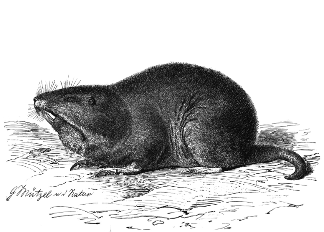

# Go Programming Notebook

*This is currently under WIP*

These are my notes where I put everything I learn from the Go Programming language. This never fails to surprise me. 

I will be including source codes and explanations as well. This is not a beginners book but more like a notebook when I try to scribble what I learn from online courses, documentations, other sample codes, etc. 

## Partial Table of Contents

- [resources.md](resources.md)
- [code-editors.md](code-editors.md)

### A little About Me
<!-- put this on another page..please -->
I am a Software Developer who is currently working closely with Node.JS and Python. I have found some curousity with the Go Programming language especially after I found out some of it's amazing features.